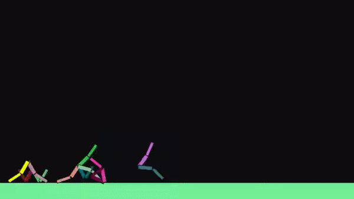

This is a simulation where 'creatures' are given a set of
evolutionary goals i.e. fitness and being selected for breeding, measured by the creature's ability to move as
far to the right as possible.

The creatures gain points based on the distance they travel from the starting point.
The further they travel in the correct direction, the more points they gain,
whereas traveling in the opposite direction will reduce the points.
The creatures are then selected for breeding based on their fitness value.
Creatures that perform better at moving in the correct direction have a
higher fitness value and hence a higher chance of reproducing.

Unlike [supervised learning](https://en.wikipedia.org/wiki/Supervised_learning),
which require a set of labeled input-outputs for training,
this project makes use of
[reinforcement learning](https://en.wikipedia.org/wiki/Reinforcement_learning),
which involves giving an agent a goal and a set of actions, and measuring
its ability to reach this goal.

This project is based on [Neuroevolution](https://en.wikipedia.org/wiki/Neuroevolution) -
a form of artificial intelligence that uses evolutionary algorithms to
generate artificial neural networks (ANN), parameters, topology and rules.

- [Demo](https://adityathebe.github.io/evolutionSimulator/)
- [Code](https://github.com/adityathebe/evolutionSimulator)
