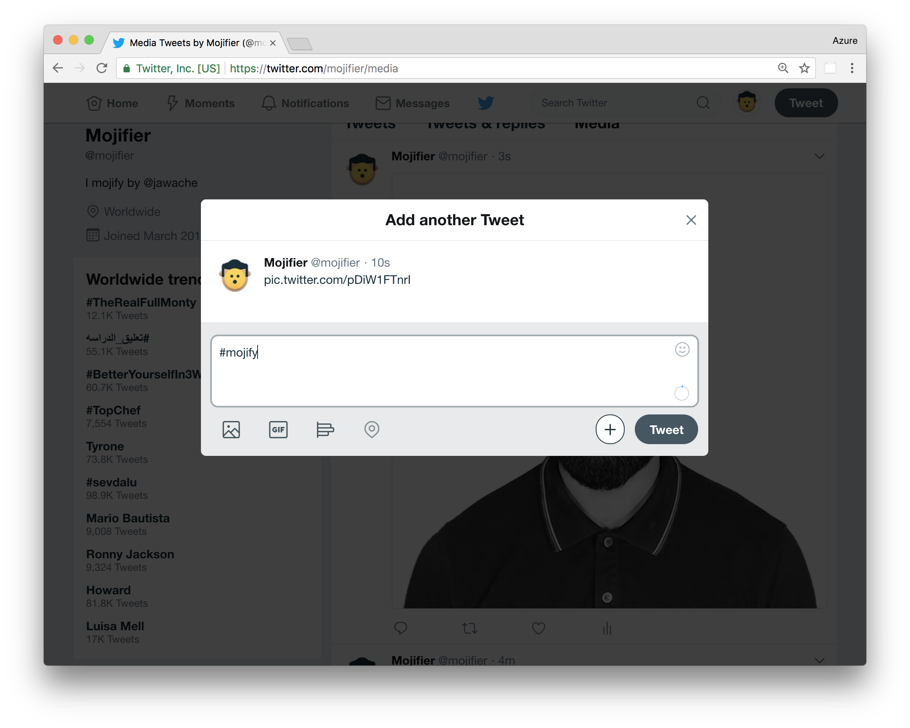
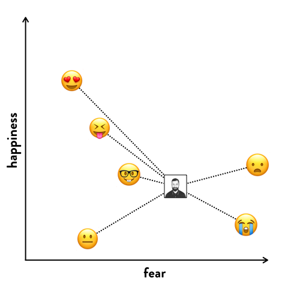
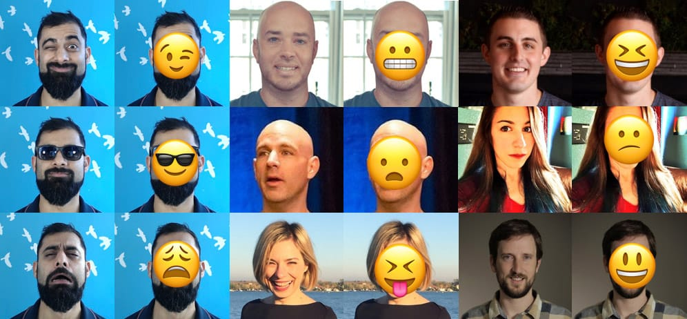
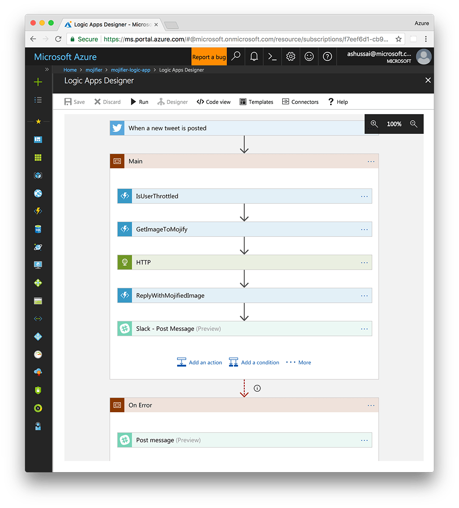
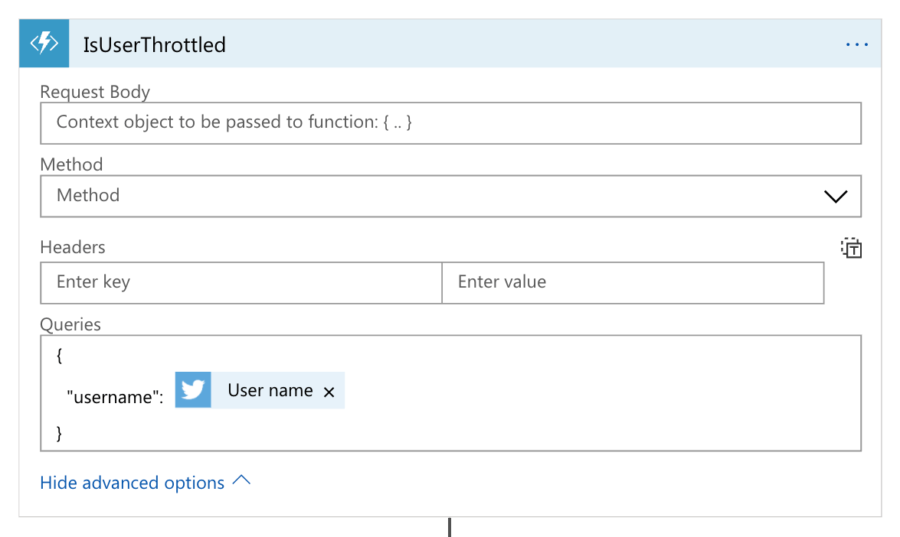
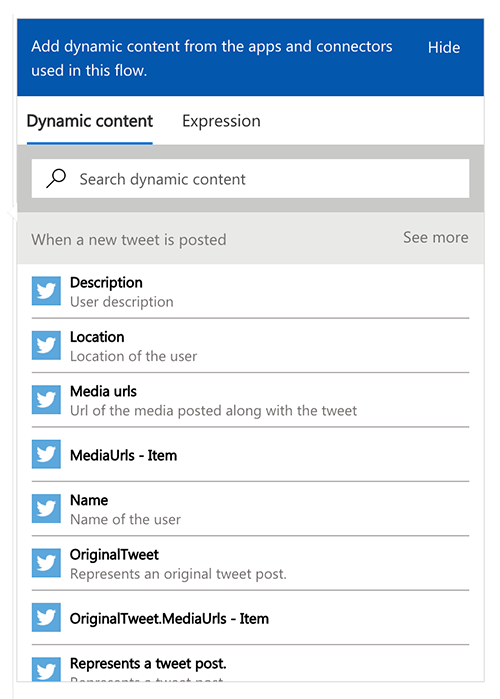
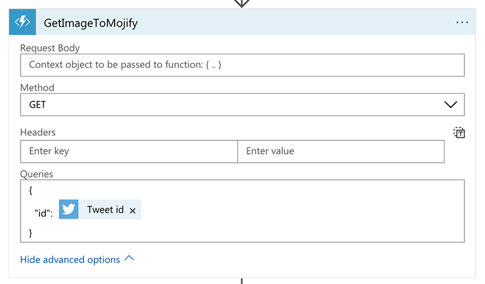
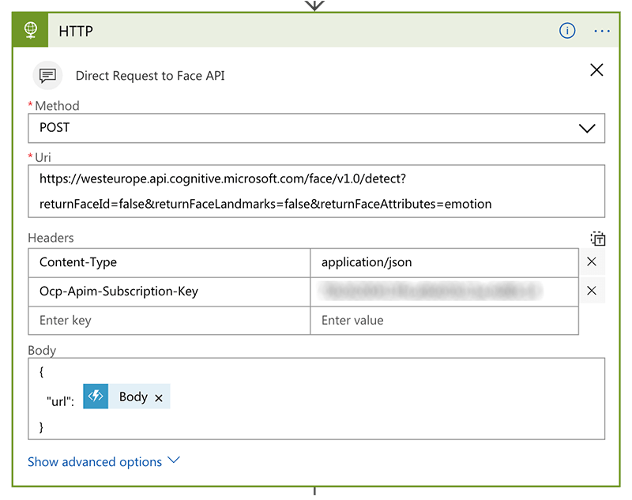
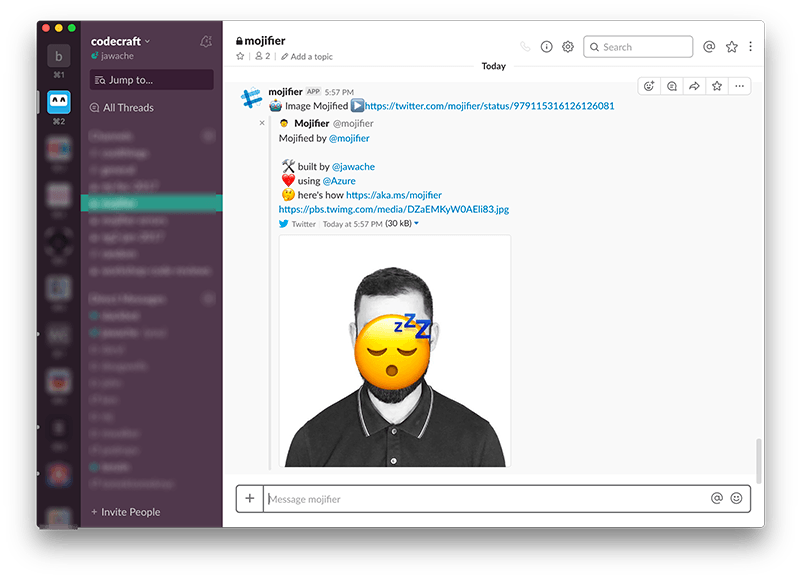
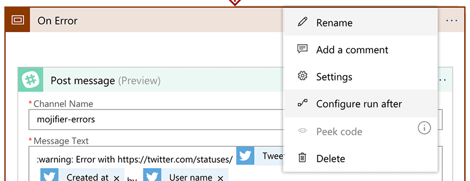

TheMojifier is a Twitter bot which replaces peoples faces in images with emojis matching their emotion, like so:


To use it reply to any tweet containing a picture (of a person) with the hashtag `#mojify`, like so:



The mojifier then:

1.  Gets the image from the tweet.

2.  Calculates the emotion of any people in the image.

3.  Matches emotions to emojis.

4.  Replaces the faces with emojis.

5.  Posts the image back to Twitter as a reply.

It’s written using TypeScript and several Azure technologies including [Azure Functions](https://azure.microsoft.com/services/functions/&WT.mc_id=mojifier-sandbox-ashussai), [Azure Logic Apps](https://azure.microsoft.com/services/logic-apps/&WT.mc_id=mojifier-sandbox-ashussai), [Azure Cognitive Services](https://azure.microsoft.com/services/cognitive-services/?WT.mc_id=mojifier-sandbox-ashussai) and [Azure Redis Cache](https://azure.microsoft.com/services/cache/?WT.mc_id=mojifier-sandbox-ashussai).

In this article I’m going to explain how TheMojifier was made and show you how to create your own Twitter bot.

All the code for Mojifier is available on [GitHub](https://github.com/jawache/mojifier), and you can follow TheMojifier ™ on Twitter at [@mojifier](https://twitter.com/mojifier).

> **Note**
> 
> I’d like to thank [Osama Jandali](https://twitter.com/osama_jandali) for creating the logo and all the artwork 😀 for TheMojifer as well as helping out with coding the Azure Functions.

# Requirements

To build the mojifier, we need to use several Azure services.

## Free Azure Account

Ok first things first, you need an accout on Azure. If you don’t already have one then you can signup and get a free years worth of services by following this [link](https://azure.microsoft.com/free/&WT.mc_id=mojifier-sandbox-ashussai).

## Azure Cognitive Services

Azure Cognitive Services are a set of high-level APIs you can use to add advanced AI functionality into your application quickly. If you can make an HTTP request, you can use Cognitive Services.

[More info](https://azure.microsoft.com/services/cognitive-services/?WT.mc_id=mojifier-sandbox-ashussai)

## Azure Logic Apps

This service enables you to create complex business logic for your app without writing any code by using a *visual designer*. It comes with a rich library of connectors like twitter and slack as well as a limited set of control flow statements such as `if`, `switch` etc…Think of it as a more expressive and customisable version of Zapier or IFTT

[More info](https://azure.microsoft.com/services/logic-apps/&WT.mc_id=mojifier-sandbox-ashussai)

## Azure Functions

As powerful as Logic Apps are sometimes you need to write business logic using the full expressiveness of a programming language. Azure Functions is a technology that lets you host snippets of code that can respond to events or HTTP requests, Azure handles all of the scaling issues for you and you only pay for what you use.

[More info](https://azure.microsoft.com/services/functions/&WT.mc_id=mojifier-sandbox-ashussai)

## Azure Redis Cache

To prevent abuse and stay under Twitter API limits the mojifier throttles users to one request every few minutes.

To do that we need to store state between runs, however both Logic Apps and Functions are stateless, the state of the previous run is not available in the next, so there is no way to know how long ago the user last triggered a mojify.

So we need to store state in something external, we chose REDIS.

[More info](https://azure.microsoft.com/services/cache/?WT.mc_id=mojifier-sandbox-ashussai)

# Overview

Before we delve too deep into the implementations let’s first answer some higher level questions.

## How to calculate the emotion of a face?

Calculating emotion is one of the easiest parts of the application. We use the [FaceAPI](https://azure.microsoft.com/services/cognitive-services/face/?WT.mc_id=mojifier-sandbox-ashussai), part of the Azure Cognitive Services offering.

The FaceAPI takes as input an image and returns information about the image, including if it detected any faces, the locations of the faces in the image and if requested it will also calculate and return the emotions of the faces as well, like so:

``` json
{
  "anger": 0.572,
  "contempt": 0.025,
  "disgust": 0.242,
  "fear": 0.001,
  "happiness": 0.014,
  "neutral": 0.111,
  "sadness": 0.033,
  "surprise": 0.003
}
```

Take for instance this image:


To process this image, you would make a POST request to an API endpoint like this:

    https://<region>.api.cognitive.microsoft.com/face/v1.0/detect?returnFaceId=false&returnFaceLandmarks=false&returnFaceAttributes=emotion

We provide the image in the body like so:

``` json
{
 "url": "<path-to-image>"
}
```

> **Note**
> 
> The API by default doesn’t return the emotion, you need to explicitly specify the query param `returnFaceAttributes=emotion`

The API is authenticated by the use of a secret key; we need to send this key with the header

    Ocp-Apim-Subscription-Key: <your-subscription-key>

The API with the query params above would return a JSON like so:

``` json
[
  {
    "faceRectangle": {
      "top": 207,
      "left": 198,
      "width": 229,
      "height": 229
    },
    "faceAttributes": {
      "emotion": {
        "anger": 0.001,
        "contempt": 0.014,
        "disgust": 0,
        "fear": 0,
        "happiness": 0.306,
        "neutral": 0.675,
        "sadness": 0.003,
        "surprise": 0.001
      }
    }
  }
]
```

It returns an array of results, one per face detected in the image. For each face, it returns the size/location of the face as `faceRectangle` and the emotions represented as a number from 0 to 1 as `faceAttributes`.

> **Tip**
> 
> You can start playing around with Cognitive Services even *without* having an Azure account, simply go to [this page](https://azure.microsoft.com/try/cognitive-services/?api=face-api&WT.mc_id=mojifier-sandbox-ashussai) and enter your email address to get trial access.

## How to map an emotion to an emoji?

Imagine there were only two emotions, fear and happiness, with values ranging from 0 to 1. Then every face could be plotted in a 2D *emotional space* based on the emotion of the user, like so:


Imagine then that we also figured out the emotional point for each emoji, and plotted those on the 2D emotional space as well. Then if we calculate the distance between your face and all the other emojis in this 2D emotional space we can figure out the closest emoji to your emotion, like so:



This calculation is called the `euclidian distance`, and this is precisely what we used but not in 2D emotional space, in an 8D emotional space with (anger, contempt, disgust, fear, happiness, neutral, sadness, surprise).

> **Tip**
> 
> To make like easier we used the npm package called euclidean-distance, <https://www.npmjs.com/package/euclidean-distance>.

## How to calculate the emotional point for all the emojis?

We can’t pass an image of the emoji to the emotion API to get it’s emotion because, well because it’s not human. So for each emoji, I needed a human proxy, me.

I took pictures of myself *accurately* mimicking each emoji, and used the *emotional point* for that image as the proxy for the emoji. To keep things interesting I also chose people from my team and associated them with emojis as well, like so:



For the emoji of love eyes (😍) I chose a picture of my wife ❤️. In memory of [Stephen Hawking](https://en.wikipedia.org/wiki/Stephen_Hawking) I picked a picture of him to represent 🤔, and there are a few other easter egg emojis as well, such as 🦄 and 💩 that have been proxied using different mages.

## How to create a composite image with the emoji?

At this point in the flow of the application we know:

1.  The list of faces in the image (if any).

2.  The emoji to use for each face.

3.  The bounding rectangle of each face in the image.

So for each face discovered in the image, we need to layer an emoji over the face, resizing the emoji to fit the face.

To implement this functionality, I used the open source image manipulation library [Jimp](https://www.npmjs.com/package/jimp).

The full source code for this feature can be found in the function `createMojifiedImage` this [file](https://github.com/jawache/mojifier/blob/master/ReplyWithMojifiedImage/index.ts).

In the function, we load the source image into Jimp like so

``` javascript
Jimp.read(imageUrl).then(sourceImage => { ... });
```

We later on load the image of the emoji like so:

``` javascript
Jimp.read(mojiPath).then(emojiImage => { ... });
```

We then resize the emoji so it will fit the size of this persons’ face, like so:

``` javascript
emojiImage.resize(faceWidth, faceHeight);
```

Then we *composite* the `emojiImage` over the `sourceImage` at the right location (the face), like so:

``` javascript
sourceImage.composite(emojiImage, faceLeft, faceTop);
```

Then finally we get the `buffer` of the jpeg of the composited image which we can use to post to twitter, like so:

``` javascript
.getBuffer(Jimp.MIME_JPEG, (error, buffer) => { ... });
```

# Implementation

The best way to understand how the mojifier works is by understanding the Logic App that orchestrates the whole flow.



## Twitter Connector

Logic Apps start with a trigger, something that will start a flow. We want to start our flow when a tweet arrives, so we use the Twitter connector. The twitter connector requires that we login using a twitter account, once setup we can configure it to trigger everytime someone posts the hashtag `#mojify`, like so:


## IsUserThrottled

The next connector in the flow is a custom function, our throttling function. This connector is an Azure Function with an HTTP trigger so theoretically we could add an HTTP connector and have the Logic App POST to it. But Azure Functions are connectors in their own right in Logic Apps so can be searched for and added just like the twitter connector above.



You can see the full code for the `IsUserThrottled` function [here](https://github.com/jawache/mojifier/blob/master/IsUserThrottled/index.ts).

With Logic Apps we can pass **outputs** from past steps as **inputs** in future steps, these are called `dynamic values`. In this step, we are passing to our `IsUserThrottled` Azure Function the **username** of the person who wrote the original tweet. When you click in any field that accepts a dynamic value, a popup box appears with a list of available values, like so:



## Error Handling

By default, if *any* step in the flow errors out then the rest of the steps are skipped. In the `IsUserThrottled` function returning an HTTP error status code will trigger the step to error out the rest of the steps to be skipped.

> **Warning**
> 
> Returning a 429 status code, which means the request timed out, will cause Logic Apps to try to auto-retry the request. That’s not the functionality we want, we want the flow to exit, so we return a 400 if the user is throttled or a 200 if they are not throttled.

## Using Authenticated calls with Azure Functions

Http triggered Azure Functions can be configured to work with three different auth levels.

  - `anonymous` is the easiest to setup and means the function is essentially open to the world, *anyone* can trigger it.

  - `function` means that only people who pass in a secret auth key can trigger it.

  - `admin` means that only admins can trigger it.

We don’t want to make our Azure Functions open to the world, so we secure them with the `function` level auth. This would *normally* mean that to trigger the function you’d have to pass in an auth key in the request, usually in the header.

However since Azure Functions are first class citizens of Logic Apps, the Logic App platform takes care of that for us. We can add in the Azure Function as a connector, and the Logic App detects it requires function level auth, extracts the auth key from the Azure Function app and pass it through for us.

## GetImageToMojify



The twitter connector does provide as one of its outputs the URL of any image in the tweet. But remember we don’t want the image in the tweet; we want the image in the tweet this tweet is in *reply* to.

This Azure function finds the right image to mojify. It first checks the current tweet, the one with the tag `#mojify`, to see if that has an image if so it returns that. Failing that it checks to see the parent tweet to see if that has an image and returns that. If it can’t find any images, it returns a 400, which errors out the flow and skips all the future steps.

You can check out the full code for this function [here](https://github.com/jawache/mojifier/blob/master/GetImageToMojify/index.ts).

## FaceAPI



Cognitive Services and the FaceAPI are first class citizens in Logic Apps and as such can be added just like any other connector.

However at the time of writing the FaceAPI when used within Logic Apps doesn’t return any emotion information, that requires some individual query params.

So for now, we will call the API using a raw HTTP connector, passing in the URL with the required query params to trigger emotion detection and also by adding in the security key.

## ReplyWithMojifedImage

`ReplyWithMojifedImage` is the primary function in our app; we pass in data about the original tweet and the FaceAPI, it’s responsible for:

1.  Calculating the emoji to use for each face.

2.  Creating an image using the Jimp library with the emojis over the faces

3.  Uploading the new image to twitter

4.  Replying to the `#mojify` tweet with the new image.

We’ve already covered at a high level how we calculate an emoji for each face and how we create a composite image with the emojis layered over the faces.


This function takes as input in the request body the output JSON from the FaceAPI call, and it also takes as query params the original image URL and information about the tweet itself.

The full source code for this function is [here](https://github.com/jawache/mojifier/tree/master/ReplyWithMojifiedImage).

## Posting to Slack on success

Finally, I want a notification everytime the mojifier runs, so I added a slack connector.

You will first need to authenticate with slack and then choose the channel where you want to post.

Then just like other actions you can use the outputs from previous steps as the inputs to this step. Since it’s slack, we can also use a slack notation for emoji in the message itself.


The above configuration results in the below message posted in slack.



## Posting to Slack on error


This is slightly more complex since *any* step in the flow can error out or be skipped.

But there is an easy way to handle this kind of issue in Logic Apps with the use of **scopes**.

By wrapping a set of steps in a scope, I’ve called ours `main`, when any of the steps in a scope fails the whole scope fails.

We can use that with the **run after** config to trigger a step if any of the previous steps have failed.

> **Tip**
> 
> I’ve created two scopes in this app, `main` and `on error`. You can configure either a step or a scope to **run after** previous steps or scopes.



Click the settings for the step and configure it to run after the main scope and only run if the main scope fails.


I’ve set this up to post another message to another slack channel if any of the steps in the flow fails.

# Configuration

Our application, specifically the Azure Functions in our app, need some configuration to run.

  - `IsUserThrottled` needs to know the connection string for the Redis instance.

  - `GetImageToMojify` & `ReplyWithMojifiedImage` both need to know the twitter credentials since they call the Twitter API.

We used environment variables to hold sensitive data like that, on localhost we can use one set of environment variables and once deployed we can use another.

In code, we grab the configuration from the environment using code like:

``` ts
process.env["TWITTER_CONSUMER_KEY"];
```

When developing with Azure Functions locally, we use the `local.settings.json` configuration file to define the environment variables for us.

> **Note**
> 
> This file isn’t checked in, we use it to set properties which should only be used locally.

Azure Functions will populate `process.env` with the contents of the `Values` property of the JSON file when running locally.

``` json
{
  "Values": { "<KEY>": "<VALUE>" }
}
```

> **Note**
> 
> An important caveat here is that the environment variables are **only set by the time the index function is called** not when the script is parsed.

This means you cannot simply use `process.env["TWITTER_CONSUMER_KEY"];` *anywhere* in your file, process.env will only be guaranteed to be set when calling the `index` function, like so:

``` javascript
export async function index(context, req) {
    // Envrionment variables only setup by this point
    process.env["..."];
}'
```

To configure the environment variables in production, we need to head to our Azure Function app and set them one at a time in the application settings page.

This manual effort can be tedious so to speed things up we can also publish the environment variables in local settings up to production using the [Azure Function CLI tool](https://github.com/Azure/azure-functions-core-tools) and this command line:

``` bash
func azure functionapp publish <my-function-app-name> --publish-settings-only
```

# Summary

All the code for Mojifier is available on GitHub [here](https://github.com/jawache/mojifier/).

This article isn’t a step by step guide for how to create your own mojifier app but instead intended to give you an overview of the architecture and an understanding of the different services used and design decisions made.

For next steps I recommend for you to play around with the project on GitHub, feel free to leave comments on the article, [open issues](https://github.com/jawache/mojifier/issues) in the repo, or submit [pull requests](https://github.com/jawache/mojifier/pulls) with fixes and new features.

Also try out these quickstarts on Azure for Logic Apps and Functions:

  - [Logic Apps Quickstart](https://docs.microsoft.com/azure/logic-apps/quickstart-create-first-logic-app-workflow?WT.mc_id=mojifier-sandbox-ashussai)

  - [Functions Quickstart](https://docs.microsoft.com/azure/azure-functions/functions-create-first-azure-function?WT.mc_id=mojifier-sandbox-ashussai)
